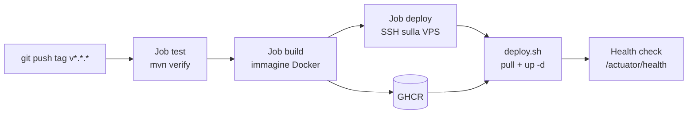

# Kodama API — Setup produzione e deploy con GitHub Actions

Sep 25, 2026 · @Alessandro

## Panoramica

Kodama API gira su un server Ubuntu come container Docker, affiancato da PostgreSQL 18 e servito da Nginx su `https://api.sakuragarden.it`. Il rilascio parte da un tag SemVer (`v1.2.0`): GitHub Actions esegue i test, costruisce l'immagine, la pubblica su GitHub Container Registry (GHCR) e ordina alla VPS di scaricarla e riavviarla. La VPS non compila nulla.



Il setup del server (parti 1–3) si fa una volta sola. La prima installazione (parte 5) coincide con il primo rilascio tramite pipeline.

### Prerequisiti

| Cosa | Dettaglio |
| --- | --- |
| VPS | Ubuntu 24.04 LTS, accesso root o sudo |
| Dominio | `sakuragarden.it` su Register, con accesso alla gestione DNS |
| Repository | `sakuragarden-community/kodama-api` su GitHub, con `Dockerfile` multi-stage e Maven Wrapper (`mvnw`) |
| App | Dipendenza `spring-boot-starter-actuator`; `/actuator/health` accessibile senza token nella configurazione di Spring Security |
| PC locale | WSL2 con `ssh`, `git` e Docker |

### Convenzioni del documento

- Immagine Docker: `ghcr.io/sakuragarden-community/kodama-api` (GHCR accetta solo nomi minuscoli).
- `<IP_VPS>`: l'indirizzo IP pubblico del server.
- Ogni blocco di comandi indica dove eseguirlo: sulla VPS oppure sul PC locale (WSL2).
- Autenticazione: OAuth 2.0 *client credentials*; il bot Discord è il client `discord-bot`.

## Parte 1 — Setup iniziale del server

Alla fine di questa parte il server ha un utente amministratore con accesso solo via chiave SSH, il firewall attivo e Docker installato.

### 1.1 Record DNS

Nel pannello di Register, sezione DNS di `sakuragarden.it`, crea un record `A` con nome `api` e valore `<IP_VPS>`. Verifica la propagazione dal PC locale:

```bash
dig +short api.sakuragarden.it
```

Il risultato deve essere l'IP della VPS (sul server: `curl -4 ifconfig.me`). Se compare un IP di Register (per esempio `195.110.124.x`), il record `api` manca e sta rispondendo il record wildcard `*` o la pagina di parcheggio. Elimina anche eventuali record `AAAA` per `api` che non puntano alla VPS: Let's Encrypt preferisce IPv6, e un `AAAA` sbagliato fa fallire Certbot con un errore 404.

### 1.2 Aggiornamenti e utente amministratore

Sulla VPS, come root:

```bash
apt update && apt upgrade -y
adduser alessandro
usermod -aG sudo alessandro
```

Dal PC locale, copia la tua chiave SSH personale sul nuovo utente (se non ne hai una: `ssh-keygen -t ed25519`):

```bash
ssh-copy-id alessandro@<IP_VPS>
```

Verifica di riuscire a entrare con `ssh alessandro@<IP_VPS>` **prima** di proseguire.

### 1.3 Hardening SSH

Sulla VPS, crea un file di override della configurazione SSH:

```bash
sudo tee /etc/ssh/sshd_config.d/99-hardening.conf > /dev/null <<'EOF'
PermitRootLogin no
PasswordAuthentication no
KbdInteractiveAuthentication no
PubkeyAuthentication yes
EOF
sudo sshd -t && sudo systemctl restart ssh
```

Tieni aperta la sessione corrente e verifica l'accesso da un secondo terminale: se qualcosa non va, puoi ancora correggere.

### 1.4 Firewall UFW

Sulla VPS:

```bash
sudo ufw default deny incoming
sudo ufw default allow outgoing
sudo ufw allow OpenSSH
sudo ufw allow 80,443/tcp
sudo ufw enable
sudo ufw status verbose
```

### 1.5 Fail2ban e aggiornamenti automatici

```bash
sudo apt install -y fail2ban unattended-upgrades
sudo systemctl enable --now fail2ban
sudo dpkg-reconfigure -plow unattended-upgrades
```

La configurazione di default di Fail2ban protegge già SSH.

### 1.6 Docker Engine e Compose

Installa Docker dal repository ufficiale:

```bash
sudo apt install -y ca-certificates curl
sudo install -m 0755 -d /etc/apt/keyrings
sudo curl -fsSL https://download.docker.com/linux/ubuntu/gpg -o /etc/apt/keyrings/docker.asc
sudo chmod a+r /etc/apt/keyrings/docker.asc
echo "deb [arch=$(dpkg --print-architecture) signed-by=/etc/apt/keyrings/docker.asc] https://download.docker.com/linux/ubuntu $(. /etc/os-release && echo "$VERSION_CODENAME") stable" | sudo tee /etc/apt/sources.list.d/docker.list > /dev/null
sudo apt update
sudo apt install -y docker-ce docker-ce-cli containerd.io docker-buildx-plugin docker-compose-plugin
sudo docker run --rm hello-world
```

**Attenzione:** Docker scrive regole iptables proprie e scavalca UFW per le porte pubblicate. Per questo il compose di produzione espone l'API solo su `127.0.0.1:8080` e non pubblica mai la porta di PostgreSQL.

### 1.7 Utente di deploy

Un utente dedicato, usato solo da GitHub Actions:

```bash
sudo adduser --disabled-password --gecos "" deploy
sudo usermod -aG docker deploy
sudo mkdir -p /var/www/kodama-nest/api/backups
sudo chown -R deploy:deploy /var/www/kodama-nest/api
```

Il gruppo `docker` equivale di fatto a privilegi root: per questo `deploy` non ha password e accede solo con la chiave creata nella Parte 4.

## Parte 2 — Nginx e HTTPS

Nginx riceve il traffico pubblico su 80/443 e lo inoltra all'API in ascolto solo su `127.0.0.1:8080`. Certbot ottiene il certificato Let's Encrypt e ne gestisce il rinnovo.

### 2.1 Installazione

Sulla VPS:

```bash
sudo apt install -y nginx certbot python3-certbot-nginx
```

### 2.2 Virtual host

Crea `/etc/nginx/sites-available/kodama`:

```nginx
server {
    listen 80;
    server_name api.sakuragarden.it;

    client_max_body_size 5m;

    # L'health check resta interno: deploy.sh lo interroga su 127.0.0.1
    location /actuator {
        deny all;
    }

    location / {
        proxy_pass http://127.0.0.1:8080;
        proxy_http_version 1.1;
        proxy_set_header Host $host;
        proxy_set_header X-Real-IP $remote_addr;
        proxy_set_header X-Forwarded-For $proxy_add_x_forwarded_for;
        proxy_set_header X-Forwarded-Proto $scheme;
        proxy_read_timeout 60s;
    }
}
```

Attivalo e disattiva il sito di default:

```bash
sudo ln -s /etc/nginx/sites-available/kodama /etc/nginx/sites-enabled/
sudo rm -f /etc/nginx/sites-enabled/default
sudo nginx -t && sudo systemctl reload nginx
```

### 2.3 Certificato HTTPS

Il record DNS della Parte 1.1 deve già puntare al server.

```bash
sudo certbot --nginx -d api.sakuragarden.it --redirect -m <tua-email> --agree-tos --no-eff-email
sudo certbot renew --dry-run
```

Certbot aggiunge il blocco `listen 443 ssl` e il redirect da HTTP a HTTPS. Il rinnovo automatico è gestito dal timer systemd `certbot.timer`.

### 2.4 Header inoltrati in Spring Boot

Perché l'app veda lo schema `https` e l'IP reale del client, crea nel repository il file `src/main/resources/application-prod.yml`. Spring Boot lo carica sopra `application.yml` solo quando è attivo il profilo `prod`, impostato dal compose con `SPRING_PROFILES_ACTIVE: prod`.

```yaml
server:
  forward-headers-strategy: framework

spring:
  docker:
    compose:
      enabled: false
```

La datasource non va messa qui: arriva dalle variabili `SPRING_DATASOURCE_*` del compose. In sviluppo nessun profilo è attivo, quindi l'integrazione Docker Compose resta attiva come prima.

Finché l'API non è in esecuzione, Nginx risponde `502 Bad Gateway`: è normale in questa fase.

## Parte 3 — Preparazione dell'app sul server

Tutto vive in `/var/www/kodama-nest/api`, di proprietà dell'utente `deploy`. I segreti restano solo qui, nel file `.env`, e non entrano mai nel repository né in GitHub.

Il `.env` non è raggiungibile dal web perché il virtual host `kodama` non ha una direttiva `root`. Non configurare mai un sito Nginx con `root /var/www` o `root /var/www/kodama-nest`: renderebbe scaricabili i file delle app.

| File | Scopo |
| --- | --- |
| `docker-compose.prod.yml` | Servizi `api` e `db` |
| `.env` | Segreti e tag dell'immagine in esecuzione |
| `deploy.sh` | Pull, riavvio e health check |
| `backup.sh` | Dump giornaliero di PostgreSQL (Parte 6) |
| `backups/` | Dump compressi |

Da qui in poi lavora come utente `deploy`:

```bash
sudo -iu deploy
cd /var/www/kodama-nest/api
```

### 3.1 docker-compose.prod.yml

Il servizio `api` usa `image:` e non `build:`: l'immagine arriva già pronta da GHCR.

```yaml
services:
  api:
    image: ghcr.io/sakuragarden-community/kodama-api:${KODAMA_TAG}
    restart: unless-stopped
    env_file: .env
    environment:
      SERVER_PORT: "8080"
      SPRING_PROFILES_ACTIVE: prod
      SPRING_DOCKER_COMPOSE_ENABLED: "false"
      SPRING_DATASOURCE_URL: jdbc:postgresql://db:5432/${POSTGRES_DB}
      SPRING_DATASOURCE_USERNAME: ${POSTGRES_USER}
      SPRING_DATASOURCE_PASSWORD: ${POSTGRES_PASSWORD}
      KODAMA_SECURITY_JWT_PRIVATEKEYLOCATION: file:/app/keys/jwt-private.pem
      KODAMA_SECURITY_JWT_PUBLICKEYLOCATION: file:/app/keys/jwt-public.pem
    volumes:
      - ./keys:/app/keys:ro
    ports:
      - "127.0.0.1:8080:8080"
    depends_on:
      db:
        condition: service_healthy

  db:
    image: postgres:18
    restart: unless-stopped
    env_file: .env
    volumes:
      - pgdata:/var/lib/postgresql
    healthcheck:
      test: ["CMD-SHELL", "pg_isready -U $${POSTGRES_USER} -d $${POSTGRES_DB}"]
      interval: 5s
      retries: 10

volumes:
  pgdata:
```

Due dettagli da non perdere:

- `SERVER_PORT: "8080"` è obbligatorio: in `application.yml` la porta di sviluppo è `8081`, e senza override l'health check riceve `Connection reset by peer`.
- Con PostgreSQL 18 il volume si monta su `/var/lib/postgresql`, non più su `/var/lib/postgresql/data`.
- `db` non pubblica porte: è raggiungibile solo dalla rete interna di Compose, con hostname `db`.
- Le chiavi JWT arrivano dalla cartella `keys/` (passo 3.5), montata in sola lettura.

### 3.2 File .env

Genera la password del database e il segreto del client del bot:

```bash
openssl rand -base64 32   # POSTGRES_PASSWORD
openssl rand -base64 32   # KODAMA_SECURITY_BOOTSTRAP_CLIENTSECRET
```

Crea `/var/www/kodama-nest/api/.env`:

```env
KODAMA_TAG=latest
KODAMA_SECURITY_BOOTSTRAP_CLIENTSECRET=<segreto generato>
POSTGRES_DB=kodama
POSTGRES_USER=kodama_user
POSTGRES_PASSWORD=<password generata>
```

Proteggilo:

```bash
chmod 600 .env
```

Le credenziali PostgreSQL valgono solo alla **prima** inizializzazione del volume. Se le cambi dopo, vanno aggiornate anche nel database con `ALTER USER`, altrimenti l'API non si connette.

**Segreto di bootstrap:** al primo avvio l'app crea il client OAuth `discord-bot`. Se `KODAMA_SECURITY_BOOTSTRAP_CLIENTSECRET` manca, genera un segreto casuale e lo stampa nei log; se l'health check fallisce, `deploy.sh` riporta quei log su GitHub Actions. Configura quindi sempre il segreto **prima** del primo deploy, e usa lo stesso valore nel bot Discord.

### 3.3 deploy.sh

Crea `/var/www/kodama-nest/api/deploy.sh`:

```bash
#!/usr/bin/env bash
set -euo pipefail

TAG="${1:?Tag immagine mancante}"
[[ "$TAG" =~ ^[A-Za-z0-9._-]+$ ]] || { echo "Tag non valido" >&2; exit 1; }

cd /var/www/kodama-nest/api
COMPOSE="docker compose -f docker-compose.prod.yml"

sed -i "s/^KODAMA_TAG=.*/KODAMA_TAG=${TAG}/" .env
$COMPOSE pull api
$COMPOSE up -d

for i in {1..60}; do
  if curl -fsS http://127.0.0.1:8080/actuator/health > /dev/null; then
    echo "Kodama API ${TAG} attiva"
    docker image prune -f
    exit 0
  fi
  sleep 2
done

echo "Health check fallito" >&2
$COMPOSE logs --tail=100 api
exit 1
```

```bash
chmod +x deploy.sh
```

Verifica la sintassi senza eseguire nulla: `bash -n deploy.sh && echo OK`. L'attesa massima è di 2 minuti (60 × 2 s): il primo avvio dell'app richiede circa 40 secondi.

Lo script scrive il tag nel file `.env`: anche dopo un riavvio manuale gira la versione corretta. Flyway applica le migrazioni all'avvio del container. `up -d` senza nome di servizio avvia anche `db` al primo giro.

### 3.4 Accesso a GHCR

Il pacchetto `kodama-api` appartiene all'organizzazione `sakuragarden-community` e GHCR lo crea **privato**. Se lo rendi pubblico (*Package settings → Change visibility*), questo passo non serve: l'immagine non contiene segreti, che restano nel `.env`.

Se resta privato, crea su GitHub un PAT *classic* (Settings → Developer settings → Personal access tokens → Tokens (classic)) con il solo scope `read:packages`, da un account membro di `sakuragarden-community`. Poi, come utente `deploy` e **senza** `sudo` (con `sudo` le credenziali finirebbero nella home di root):

```bash
echo "<PAT>" | docker login ghcr.io -u <tuo-utente> --password-stdin
```

Dopo il primo build, verifica con un pull manuale: `docker pull ghcr.io/sakuragarden-community/kodama-api:latest`. Se risponde `unauthorized`:

- l'organizzazione usa SAML SSO → nella lista dei token, **Configure SSO** e autorizza il PAT per `sakuragarden-community`;
- il tuo account non ha accesso al pacchetto → *Package settings → Manage access*, ruolo almeno **Read**.

Le credenziali sono salvate in `~deploy/.docker/config.json`. Imposta una scadenza al PAT e segnati di rinnovarlo.

### 3.5 Chiavi JWT

Senza una coppia di chiavi fissa l'app ne genera una effimera, e ogni riavvio invalida tutti i token emessi. Come utente `deploy`, in `/var/www/kodama-nest/api`:

```bash
mkdir -p keys
openssl genpkey -algorithm RSA -pkeyopt rsa_keygen_bits:2048 -out keys/jwt-private.pem
openssl rsa -in keys/jwt-private.pem -pubout -out keys/jwt-public.pem
```

Nel container l'app gira come utente `kodama` con UID fisso `10001` (vedi il `Dockerfile` al passo 4.0): assegnagli le chiavi e restringi i permessi.

```bash
sudo chown -R 10001:10001 keys
sudo chmod 700 keys
sudo chmod 400 keys/jwt-private.pem
sudo chmod 444 keys/jwt-public.pem
```

`openssl genpkey` produce la chiave privata in formato PEM PKCS#8, quello letto da `JwtKeyProvider`. Conserva una copia delle chiavi fuori dal server: se le perdi, i client dovranno semplicemente richiedere un nuovo token.

## Parte 4 — Pipeline GitHub Actions

La pipeline ha tre job in sequenza: `test`, `build` (push su GHCR) e `deploy` (SSH sulla VPS). Si attiva a ogni tag `v*.*.*` o a mano dalla tab Actions.

### 4.0 Preparazione del repository

La pipeline presuppone quattro file nel repository `kodama-api`, oltre a `application-prod.yml` (passo 2.4).

**Dockerfile** multi-stage nella root. L'utente `kodama` ha UID fisso `10001`, lo stesso a cui appartengono le chiavi JWT sul server:

```dockerfile
# syntax=docker/dockerfile:1

# --- Build ---
FROM eclipse-temurin:25-jdk AS build
WORKDIR /app

COPY .mvn/ .mvn/
COPY mvnw pom.xml ./
RUN chmod +x mvnw && ./mvnw -B dependency:go-offline

COPY src/ src/
RUN ./mvnw -B package -DskipTests

# --- Runtime ---
FROM eclipse-temurin:25-jre
WORKDIR /app

RUN groupadd --system --gid 10001 kodama \
 && useradd --system --uid 10001 --gid kodama kodama
COPY --from=build /app/target/*.jar app.jar

USER kodama
EXPOSE 8080
ENTRYPOINT ["java", "-jar", "app.jar"]
```

**.dockerignore**, per tenere fuori dall'immagine build locali e segreti:

```text
target/
.git/
.idea/
*.iml
.env
compose.yaml
docker-compose*.yml
```

**Testcontainers** per i test di integrazione: sul runner di GitHub non c'è PostgreSQL, e i test con `@SpringBootTest` fallirebbero con `Connection refused`. Dipendenze di test nel `pom.xml`:

```xml
<dependency>
    <groupId>org.springframework.boot</groupId>
    <artifactId>spring-boot-testcontainers</artifactId>
    <scope>test</scope>
</dependency>
<dependency>
    <groupId>org.testcontainers</groupId>
    <artifactId>testcontainers-postgresql</artifactId>
    <scope>test</scope>
</dependency>
```

Configurazione in `src/test/java/it/sakura/garden/kodamaapi/TestcontainersConfiguration.java`:

```java
package it.sakura.garden.kodamaapi;

import org.springframework.boot.test.context.TestConfiguration;
import org.springframework.boot.testcontainers.service.connection.ServiceConnection;
import org.springframework.context.annotation.Bean;
import org.testcontainers.postgresql.PostgreSQLContainer;
import org.testcontainers.utility.DockerImageName;

@TestConfiguration(proxyBeanMethods = false)
public class TestcontainersConfiguration {

    @Bean
    @ServiceConnection
    PostgreSQLContainer postgresContainer() {
        return new PostgreSQLContainer(DockerImageName.parse("postgres:18"));
    }
}
```

Ogni classe con `@SpringBootTest` la importa con `@Import(TestcontainersConfiguration.class)` (import di `org.springframework.context.annotation.Import`, più `it.sakura.garden.kodamaapi.TestcontainersConfiguration` nei sottopackage).

Prima di pushare, verifica in locale con il database di sviluppo spento:

```bash
docker compose down
./mvnw -B verify
docker build -t kodama-api:test .
```

### 4.1 Chiave SSH per GitHub Actions

Sul PC locale, crea una chiave usata solo per il deploy:

```bash
ssh-keygen -t ed25519 -C "github-actions-kodama" -f ~/.ssh/kodama_deploy -N ""
```

L'utente `deploy` non ha password, quindi `ssh-copy-id` non funziona. Installa la chiave pubblica dalla tua sessione amministratore sulla VPS:

```bash
sudo mkdir -p /home/deploy/.ssh
echo "<contenuto di kodama_deploy.pub>" | sudo tee -a /home/deploy/.ssh/authorized_keys
sudo chown -R deploy:deploy /home/deploy/.ssh
sudo chmod 700 /home/deploy/.ssh
sudo chmod 600 /home/deploy/.ssh/authorized_keys
```

Dal PC locale verifica l'accesso e recupera la fingerprint del server:

```bash
ssh -i ~/.ssh/kodama_deploy deploy@api.sakuragarden.it 'docker ps'
ssh-keyscan -p 22 api.sakuragarden.it
```

### 4.2 Environment e secret su GitHub

Nel repository: **Settings → Environments → New environment** → `production`. Aggiungi questi secret all'environment:

| Secret | Valore |
| --- | --- |
| `VPS_HOST` | `api.sakuragarden.it` |
| `VPS_PORT` | `22` (o la porta SSH che usi) |
| `VPS_USER` | `deploy` |
| `VPS_SSH_KEY` | contenuto di `~/.ssh/kodama_deploy` (chiave **privata**) |
| `VPS_KNOWN_HOSTS` | output di `ssh-keyscan` del passo 4.1 |

Per il push su GHCR non serve alcun secret: basta il `GITHUB_TOKEN` automatico con permesso `packages: write`.

Consigliato: in *Environments → production* attiva **Required reviewers** con te stesso. Ogni deploy aspetterà la tua approvazione.

### 4.3 Workflow

Nel repository, crea `.github/workflows/deploy.yml`:

```yaml
name: Deploy

on:
  push:
    tags: ['v*.*.*']
  workflow_dispatch:

concurrency:
  group: deploy-production
  cancel-in-progress: false

env:
  REGISTRY: ghcr.io
  IMAGE_NAME: ${{ github.repository }}

jobs:
  test:
    runs-on: ubuntu-latest
    steps:
      - uses: actions/checkout@v4
      - uses: actions/setup-java@v4
        with:
          distribution: temurin
          java-version: '25'
          cache: maven
      - run: ./mvnw -B verify -Dsurefire.useFile=false -DtrimStackTrace=false

  build:
    needs: test
    runs-on: ubuntu-latest
    permissions:
      contents: read
      packages: write
    outputs:
      tag: ${{ steps.meta.outputs.version }}
    steps:
      - uses: actions/checkout@v4
      - uses: docker/setup-buildx-action@v3
      - uses: docker/login-action@v3
        with:
          registry: ${{ env.REGISTRY }}
          username: ${{ github.actor }}
          password: ${{ secrets.GITHUB_TOKEN }}
      - id: meta
        uses: docker/metadata-action@v5
        with:
          images: ${{ env.REGISTRY }}/${{ env.IMAGE_NAME }}
          tags: |
            type=semver,pattern={{version}}
            type=sha,prefix=sha-
      - uses: docker/build-push-action@v6
        with:
          context: .
          push: true
          tags: ${{ steps.meta.outputs.tags }}
          labels: ${{ steps.meta.outputs.labels }}
          cache-from: type=gha
          cache-to: type=gha,mode=max

  deploy:
    needs: build
    runs-on: ubuntu-latest
    environment: production
    steps:
      - name: Configura SSH
        run: |
          mkdir -p ~/.ssh
          echo "${{ secrets.VPS_SSH_KEY }}" > ~/.ssh/id_ed25519
          chmod 600 ~/.ssh/id_ed25519
          echo "${{ secrets.VPS_KNOWN_HOSTS }}" > ~/.ssh/known_hosts
      - name: Deploy sulla VPS
        run: |
          ssh -p ${{ secrets.VPS_PORT }} \
            ${{ secrets.VPS_USER }}@${{ secrets.VPS_HOST }} \
            "/var/www/kodama-nest/api/deploy.sh ${{ needs.build.outputs.tag }}"
```

Note sul workflow:

- Le opzioni di Surefire stampano lo stack trace completo dei test falliti direttamente nel log del job.
- Il job `build` usa il `Dockerfile` del passo 4.0. Il nome dell'immagine deriva da `github.repository`: `ghcr.io/sakuragarden-community/kodama-api`.
- Con un tag `v1.2.0` l'immagine riceve i tag `1.2.0`, `sha-<commit>` e `latest`. Con **Run workflow** (tab Actions) riceve `sha-<commit>` e `latest`: utile per provare la pipeline senza consumare un numero di versione.
- **Re-run jobs** riusa sempre il commit originale dell'esecuzione: dopo una correzione nel codice serve una nuova esecuzione. Dopo una correzione solo sul server (script, compose, `.env`) basta invece **Re-run failed jobs**.
- GitHub oscura i valori dei secret nei log: il valore di `VPS_USER` è `deploy`, quindi anche `deploy.sh` appare come `***.sh`.
- `concurrency` impedisce due deploy in parallelo.

### 4.4 Chiave limitata allo script (opzionale)

Per impedire che la chiave di GitHub esegua comandi arbitrari, anteponi in `authorized_keys` di `deploy`:

```text
command="/var/www/kodama-nest/api/deploy.sh $SSH_ORIGINAL_COMMAND",no-pty,no-port-forwarding,no-agent-forwarding ssh-ed25519 AAAA... github-actions-kodama
```

In questo caso, nell'ultimo step del workflow passa solo il tag: `"${{ needs.build.outputs.tag }}"`. Il comando `ssh ... 'docker ps'` del passo 4.1 non funzionerà più con questa chiave.

## Parte 5 — Prima installazione

La prima installazione è il primo rilascio tramite pipeline: `deploy.sh` scarica l'immagine, inizializza il volume PostgreSQL e avvia l'API, che applica le migrazioni Flyway.

### 5.1 Checklist prima del primo tag

- [ ] `dig +short api.sakuragarden.it` restituisce l'IP della VPS (nessun `AAAA` sbagliato)
- [ ] UFW attivo con 22, 80 e 443 aperte
- [ ] Certificato HTTPS emesso e `certbot renew --dry-run` riuscito
- [ ] Nel repository: `Dockerfile`, `.dockerignore`, `application-prod.yml` e Testcontainers; `./mvnw -B verify` passa con il database di sviluppo spento
- [ ] Actuator nel `pom.xml` e `/actuator/health` accessibile senza token
- [ ] `/var/www/kodama-nest/api` contiene `docker-compose.prod.yml`, `.env` (permessi 600) e `deploy.sh` eseguibile (`bash -n` senza errori)
- [ ] `.env` contiene `KODAMA_SECURITY_BOOTSTRAP_CLIENTSECRET`
- [ ] Chiavi JWT in `keys/`, di proprietà dell'UID `10001`
- [ ] Login a GHCR eseguito come `deploy` senza `sudo` (solo pacchetto privato)
- [ ] Accesso SSH con `kodama_deploy` verificato
- [ ] Environment `production` con i 5 secret
- [ ] `.github/workflows/deploy.yml` presente su `main`

### 5.2 Primo rilascio

Sul PC locale, dal branch `main` aggiornato:

```bash
git tag v0.1.0
git push origin v0.1.0
```

Segui l'esecuzione nella tab **Actions**. Se hai attivato *Required reviewers*, approva il job `deploy` quando si ferma in attesa.

In alternativa al tag, puoi avviare la pipeline da **Actions → Deploy → Run workflow** sul branch `main` (oppure `gh workflow run deploy.yml --ref main`). L'immagine riceve il tag `sha-<commit>`: comodo per il primo collaudo.

### 5.3 Verifica sul server

Sulla VPS, come `deploy`:

```bash
cd /var/www/kodama-nest/api
docker compose -f docker-compose.prod.yml ps
docker compose -f docker-compose.prod.yml logs --tail=50 api
grep KODAMA_TAG .env
```

Entrambi i servizi devono risultare `running` (e `db` anche `healthy`); `KODAMA_TAG` deve valere `0.1.0`.

Controlla le migrazioni applicate da Flyway:

```bash
docker compose -f docker-compose.prod.yml exec db \
  psql -U kodama_user -d kodama -c 'SELECT version, description, success FROM flyway_schema_history;'
```

### 5.4 Verifica dall'esterno

Sul PC locale (serve `jq`: `sudo apt install jq`). I percorsi dell'endpoint del token e delle API sono quelli dei controller dell'app: adattali se diversi.

```bash
BASE=https://api.sakuragarden.it
TOKEN_URL=$BASE/oauth2/token
API_URL=$BASE/api/v1/members

# 1. Redirect HTTP → HTTPS: atteso 301
curl -sI http://api.sakuragarden.it | head -1

# 2. Actuator bloccato da Nginx: atteso 403
curl -s -o /dev/null -w "%{http_code}\n" $BASE/actuator/health

# 3. API senza token: atteso 401
curl -s -o /dev/null -w "%{http_code}\n" $API_URL
```

Ottieni un token con il client del bot. `read -rs` evita che il segreto finisca nella history della shell:

```bash
read -rsp "Client secret: " CLIENT_SECRET; echo

TOKEN=$(curl -s -u "discord-bot:$CLIENT_SECRET" \
  -d grant_type=client_credentials "$TOKEN_URL" | jq -r .access_token)

echo "${TOKEN:0:20}..."   # deve stampare l'inizio di un JWT (eyJ...)

# 4. API con token: atteso 200 e JSON
curl -s -H "Authorization: Bearer $TOKEN" $API_URL | jq

# 5. Segreto sbagliato: atteso 401
curl -s -o /dev/null -w "%{http_code}\n" -u "discord-bot:sbagliato" \
  -d grant_type=client_credentials "$TOKEN_URL"
```

**Persistenza delle chiavi JWT:** sulla VPS riavvia l'API (`docker compose -f docker-compose.prod.yml restart api`), attendi l'avvio e ripeti il test 4 con lo **stesso** token. Deve rispondere ancora 200; un 401 significa che le chiavi del passo 3.5 non vengono lette.

### 5.5 Se la pipeline fallisce

| Sintomo | Causa probabile | Soluzione |
| --- | --- | --- |
| Test falliti con `Connection refused` verso PostgreSQL | Test di integrazione senza database in CI | Testcontainers (passo 4.0) |
| `open Dockerfile: no such file or directory` | `Dockerfile` non committato o in un'altra cartella | Commit del file, oppure `file:` nello step `build-push-action` |
| `Host key verification failed` | `VPS_KNOWN_HOSTS` errato o porta diversa | Rigenera con `ssh-keyscan -p <porta>` e aggiorna il secret |
| `Permission denied (publickey)` | Chiave pubblica mancante o permessi errati | Ricontrolla il passo 4.1 (`700` su `.ssh`, `600` su `authorized_keys`) |
| `unexpected EOF while looking for matching` | Errore di quoting in `deploy.sh` | `bash -n deploy.sh` e correggi la riga indicata |
| `unauthorized` nel pull | `deploy` non autenticato su GHCR (login fatto con `sudo`), PAT senza SSO o senza accesso | Passo 3.4 |
| `manifest unknown` | Nome immagine o tag errati | `ghcr.io/sakuragarden-community/kodama-api`, tutto minuscolo |
| Health check con `Connection reset by peer` / `Empty reply`, log con `Tomcat started on port 8081` | L'app ascolta su una porta diversa da 8080 | `SERVER_PORT: "8080"` nel compose |
| Log con `Nessuna chiave JWT configurata` | Chiavi assenti o non leggibili dall'UID `10001` | Passo 3.5 |
| Log con `client_secret` in chiaro | Segreto di bootstrap non configurato | Cancella i log dell'esecuzione su GitHub, imposta il segreto nel `.env`; al primo setup `down -v` e nuovo deploy |
| `password authentication failed` | Credenziali `.env` diverse da quelle del volume | Allinea con `ALTER USER` o, solo al primo setup, `down -v` |
| Errore Flyway all'avvio | Migrazione non valida | Correggi la migrazione e rilascia un nuovo tag patch |

## Parte 6 — Backup, rilasci e rollback

### 6.1 Backup automatico di PostgreSQL

Crea `/var/www/kodama-nest/api/backup.sh`:

```bash
#!/usr/bin/env bash
set -euo pipefail

cd /var/www/kodama-nest/api
set -a; source .env; set +a

FILE="backups/kodama_$(date +%Y%m%d_%H%M%S).sql.gz"
docker compose -f docker-compose.prod.yml exec -T db \
  pg_dump -U "$POSTGRES_USER" -d "$POSTGRES_DB" --no-owner | gzip > "$FILE"

# Conserva gli ultimi 14 giorni
find backups -name 'kodama_*.sql.gz' -mtime +14 -delete
```

Rendilo eseguibile e pianificalo ogni notte alle 3:15 nella crontab di `deploy`:

```bash
chmod +x backup.sh
./backup.sh && ls -lh backups/
crontab -e
```

```text
15 3 * * * /var/www/kodama-nest/api/backup.sh >> /var/www/kodama-nest/api/backups/backup.log 2>&1
```

I backup sulla stessa VPS non proteggono da un guasto del server: copiali periodicamente altrove (per esempio con `rsync` verso il PC o uno storage esterno).

**Ripristino** di un dump:

```bash
gunzip -c backups/kodama_<data>.sql.gz | \
  docker compose -f docker-compose.prod.yml exec -T db psql -U kodama_user -d kodama
```

### 6.2 Rilasci successivi

Con Conventional Commits il numero di versione segue il tipo di modifiche:

| Commit dal rilascio precedente | Esempio | Nuovo tag |
| --- | --- | --- |
| Solo `fix:` | `v0.1.0` → | `v0.1.1` |
| Almeno un `feat:` | `v0.1.1` → | `v0.2.0` |
| `BREAKING CHANGE` o `feat!:` | `v0.2.0` → | `v1.0.0` (o `v0.3.0` finché sei in 0.x) |

```bash
git tag v0.1.1
git push origin v0.1.1
```

Prima di un rilascio con migrazioni Flyway distruttive, esegui a mano `./backup.sh` sul server.

### 6.3 Rollback

Ogni versione resta disponibile su GHCR. Sulla VPS, come `deploy`:

```bash
/var/www/kodama-nest/api/deploy.sh 0.1.0
```

Flyway non annulla le migrazioni: tornare a una versione precedente funziona solo se lo schema attuale è ancora compatibile. Se non lo è, ripristina il backup fatto prima del rilascio.

Per i deploy avviati a mano il tag ha la forma `sha-<commit>`: l'elenco dei tag disponibili è nella pagina del pacchetto su GitHub (*sakuragarden-community → Packages → kodama-api*).

### 6.4 Comandi utili

| Scopo | Comando (in `/var/www/kodama-nest/api`) |
| --- | --- |
| Stato dei servizi | `docker compose -f docker-compose.prod.yml ps` |
| Log in tempo reale | `docker compose -f docker-compose.prod.yml logs -f api` |
| Riavvio API | `docker compose -f docker-compose.prod.yml restart api` |
| Versione in esecuzione | `grep KODAMA_TAG .env` |
| Spazio usato da Docker | `docker system df` |
| Log di Nginx | `sudo tail -f /var/log/nginx/error.log` |
